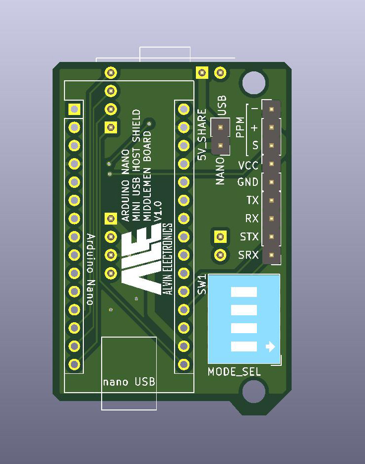
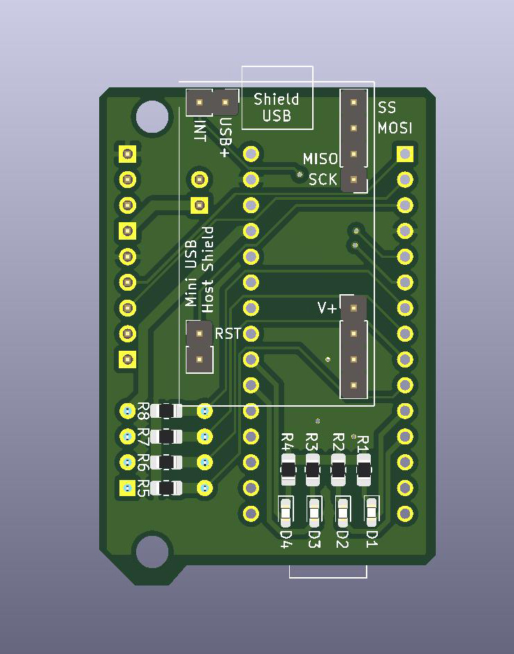
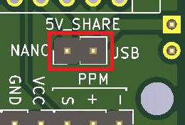
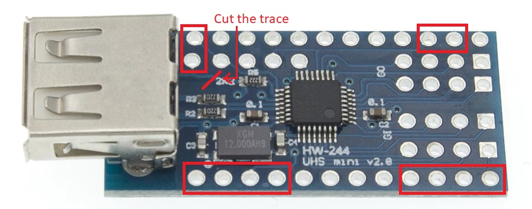
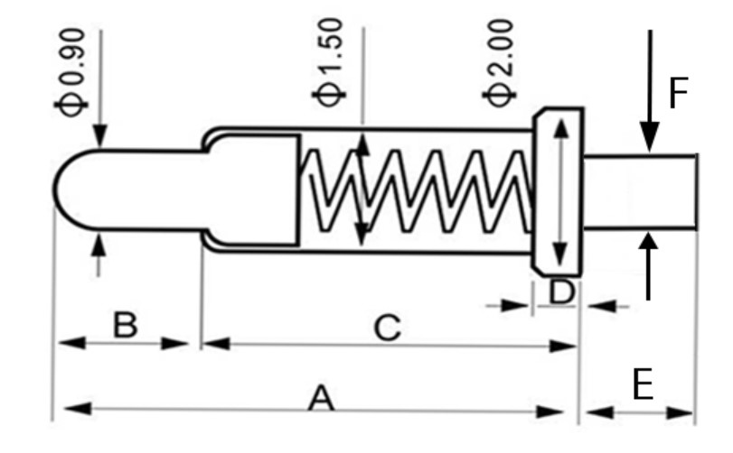

# arduino_nano_usb_host_shield
An USB host shield for Arduino Nano, built from a mini USB host shield

This project creates an interface to combine easy accessed Arduino Nano and Arduino Mini USB Host Shield. This can be meaningless as USB Host Shield for Arduino Uno is everywhere on the market. If size doesn't matter, that would be a far easier option.

## Hardware

### BOM

| Reference   | Quantity | Value           | Footprint                  |
| ----------- | -------- | --------------- | -------------------------- | 
| A1          | 1        | Arduino_Nano    |                            |
| D1 D2 D3 D4 | 4        | LED             | LED_0603                   |
| 5V_share    | 1        | Conn_01x02_Male | Connector_PinHeader_2.54mm |
| Output      | 1        | Conn_01x09_Male | Connector_PinHeader_2.54mm |
| Host_Shield | 2        | Conn_01x02_Male | Connector_PinHeader_2.54mm |
| Host_Shield | 2        | Conn_01x04_Male | Connector_PinHeader_2.54mm |
| Nano pin    | 13       | Conn_01x13_Male | Connector_PinHeader_2.54mm |
| R1 R2 R3 R4 | 4        | 220             | R_0805                     |
| R5 R6 R7 R8 | 4        | 10k             | R_0805                     |
| SW1         | 1        | SW_DIP_x04      | SW_DIP_SPSTx04_Slide       |

### Preview

### Pins

#### Assignment

| Pin  | Usage     |
| ---- | --------- |
| A0   | IO        |
| A1   | IO        |
| 0	   | Serial RX |
| 1    | Serial TX |
| A2   | PWM out   |
| 4    | Switch 1  |
| 5    | Switch 2  |
| 6    | Switch 3  |
| 7    | Switch 4  |
| 8    | LED 1     |
| 9    | LED 2     |
| A2   | LED 3     |
| A3   | LED 4     |

There are 4 programmable LEDs and 4 switches on the board, which allows multiple purposes.

A Serial, a PWM pin, and 2 IO pins are routed to usable headers. PWM pins is for PPM output, and the IO pins are for software serial.

If you are happy to power everything with single source, put a jumper on the header below:

Otherwise, use the headers to provide private power to Arduino Nano and USB device respectively.

#### Soldering Tips

The stock Arduino Mini USB Host Shield uses 3.3V from Arduino Mini to power up the USB device. Usually this is not enough. Clone boards removed a VBUS jumper so there is no voltage selection, cut the trace and use middleman board to supply 5V to USB device.

Solder headers to labeled pins.

Soldering both boards to the middleman board would cause huge pain if any repairing is needed later. Consider using socket or pogo pin for Arduino's side. Reference dimensions:

with A=5, B=1.5, C=3.5, E=2, F=0.8, 13pin, plastic housing interval 2.54, width 2.55, height 2.5

#### Housing

The 3D printable housing is designed for pogo pins or headers. If you have the top headers on Arduino or using socket for connection, the housing will be too small.

There are some buckles to press the pogo pins continuously, as the screws are too far away to keep adding pressing, due to lack of space. Remove the buckles if you soldered everything together with headers.

## Software

Uses USB_Host_Shield_2.0 library by felis

https://github.com/felis/USB_Host_Shield_2.0

It should work on the Nano.
