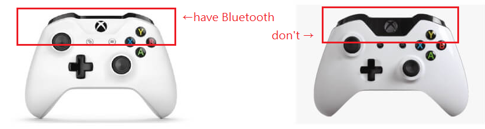

## Library

The example program uses USB_Host_Shield_2.0 library by felis, and PPMEncoder library by schinken. Make sure you have them installed.

https://github.com/felis/USB_Host_Shield_2.0

https://github.com/schinken/PPMEncoder

## USB device

In the example, the xboxone controller with Bluetooth combability is used. Distinguish the correct controller:

Bluetooth dongle used:
UGREEN USB Bluetooth 4.0 Receiver Adapter

The dongle can be powered by Arduino with USB power. It won't be enough if you connect the controller via USB, wiredly. In that case, disconnect `5V_share` jumper and provide independent 5V to the device.

After xbox library initialized successfully, LED1 will turn on. Switch the controller to pairing mode before power on the board, or reset the Arduino after that.

## Serial mode

If you want to keep signals visible on pc serial, connect software serial pins to target device. However, this may reduce output speed as more operations are running.

Baud rate is adjustable but consider the maximum speed at the receiving side.

## PPM mode

To switch to PPM output mode, turn on the switch 1. However, this mode was never tested since I have lost my interest on the project, as I realized having only 8 channels is not going to work well with gaming controllers.